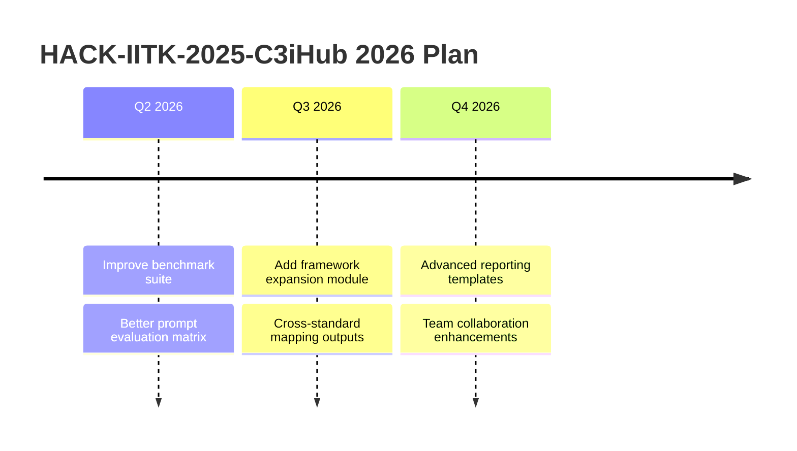
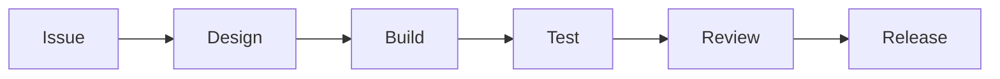
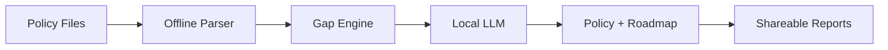

    

---

---

## Core Capabilities

| Analyze       | Revise         | Roadmap     | Deliver      |
| ------------- | -------------- | ----------- | ------------ |
| Gap detection | Policy rewrite | Phased plan | DOCX/PDF/ZIP |

---

## Visual Dashboard

---

## Team

| Member       | Role             | GitHub Profile                          |
| ------------ | ---------------- | --------------------------------------- |
| Aditya Yadav | Model Developer  | [Aditya](https://github.com/Im-diablo)  |
| Amol Gupta   | Server Developer | [Amol](https://github.com/FighterX777)  |
| Aman Kothari | Security Tester  | [Aman](https://github.com/Drag0nSlay)   |
| Amadeep      | Researcher       | [Amardeep](https://github.com/Amar1604) |

---

## Highlights

---

## Project Portfolio

| Project                                                               | Stage       | What It Does                              |
| --------------------------------------------------------------------- | ----------- | ----------------------------------------- |
| [Local-LLM-UI](https://github.com/HACK-IITK-2025-C3iHub/Local-LLM-UI) | Production  | End-to-end offline policy gap analyzer    |
| Policy Benchmark Pack                                                 | In Progress | Test policies and benchmark datasets      |
| Framework Expansion                                                   | Im Progress | Extend to ISO 27001, PCI DSS, CIS mapping |

---

## 2026 Roadmap

---

## Engineering Workflow

---

## Pipeline

---

## Jump In

---

## Contact

